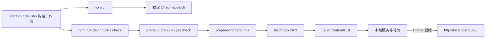

# 项目上下文摘要（VibeChat 桌面构建收敛）

生成时间：2026-07-26 13:33:45 +08:00

## 1. 目标、范围与交付物

- 目标：让 `desktop-tauri` 从全新克隆即可重复安装、测试和构建，并让服务未就绪提示页真正参与启动流程。
- 范围：桌面包脚本、Tauri 配置、Rust 壳、Linux/WSL 启动脚本、桌面构建工作流和对应文档。
- 非目标：不重写 Tinode Web、不改 NPC 业务逻辑、不新增桌面功能或依赖。
- 交付物：代码与配置改动、锁文件、自动测试、操作日志和本地验证报告。
- 审查要点：直接 `npm run build` 是否完整；`npm ci` 是否可复现；启动页是否无个人路径；未使用依赖是否清理；既有 NPC 测试是否无回归。

## 2. 相似实现与现状分析

### 实现 1：包级构建入口

- 位置：`desktop-tauri/package.json`
- 现状：`build` 直接执行 `tauri build`，没有准备 `dist/index.html`，也没有测试或综合检查入口。
- 可复用模式：继续使用 npm 生命周期脚本，将静态前端准备放到 `prebuild`、`predev` 和 `precheck`，让所有调用者共享同一入口。
- 约束：项目使用 ES 模块；Node.js 22 可直接使用内置 `node:test`、`fs/promises` 和 `node:assert`，无需新增测试依赖。

### 实现 2：Shell 启动入口

- 位置：`desktop-tauri/start.sh`、`desktop-tauri/dev.sh`
- 现状：两个入口都在缺少 `node_modules` 时执行 `npm install`，且 `start.sh` 手工复制前端文件。
- 可复用模式：保留 `set -euo pipefail`、脚本目录自定位和首次构建逻辑；依赖安装统一改为 `npm ci`，前端准备交给包脚本。
- 约束：脚本主要面向 Linux/WSLg；Windows 浏览器应用入口不在本次改动范围。

### 实现 3：自动构建入口

- 位置：`.github/workflows/build.yml`
- 现状：工作流单独执行 `mkdir/cp` 和 `npm install`，与本地包脚本产生两套构建协议。
- 可复用模式：继续使用现有三平台 Tauri 矩阵，只将依赖安装收敛到 `npm ci`，让 `npm run build` 自己准备前端。
- 约束：远程流水线只作为发布配置；本次验收仅使用本地自动验证。

### 实现 4：Tauri 运行入口

- 位置：`desktop-tauri/src-tauri/tauri.conf.json`、`desktop-tauri/index.html`、`desktop-tauri/src-tauri/src/lib.rs`
- 现状：窗口直接打开 `http://localhost:6060/`，因此本地兜底页不会显示；页面提示写死个人路径；Rust 壳注册了从未使用的 Shell 插件。
- 可复用模式：省略窗口 `url` 后由 `frontendDist` 的 `index.html` 启动，再由现有探测脚本在 Tinode 就绪后跳转。
- 约束：前端不调用 Tauri IPC，也没有序列化数据，因此 Shell、Serde 和 Serde JSON 均无调用点。

### 实现 5：既有测试风格

- 位置：`tests/test_npc_core.py`
- 模式：使用标准库 `unittest`，测试名称和说明使用简体中文，覆盖正常、边界与失败场景。
- 新增测试策略：桌面包保持零新增依赖，使用 Node.js 标准测试框架验证复制、目录创建、缺失源文件失败和等待页配置四个分支；原 7 项 Python 测试继续作为回归检查。

## 3. 开源实现检索

通过已认证的 `gh search code` 检索公开 Tauri 项目中的 `package.json`：

- [compressO](https://github.com/codeforreal1/compressO/blob/41ee3f8e27bf407019ed300ea8e5208319073d5c/package.json)：将 Tauri 开发、构建和平台构建统一暴露为包脚本。
- [dev-manager-desktop](https://github.com/webosbrew/dev-manager-desktop/blob/fa3a0d95450902eaac49cf1014405745559b2231/package.json)：通过 Node 包装脚本集中处理 Tauri 调用细节。
- [Dataflare](https://github.com/DataflareApp/dataflare/blob/23e1d085875a5318e158d7462b8b5d8c194b68e8/package.json)：把 Tauri 构建、Web 构建、格式化和开发入口集中到包级协议。
- [Tauri 官方项目模板](https://github.com/tauri-apps/create-tauri-app/blob/55a9932ffb1e1986382eeb1829e1b4483318dc95/templates/_base_/src-tauri/_gitignore)：明确将 `/gen/schemas` 标为 Tauri 自动生成的能力补全文件并忽略。

用途：确认“调用者只运行统一包脚本、准备逻辑由包内封装”的生态惯例，避免在工作流和 Shell 中复制构建步骤。

## 4. 项目约定

- 命名约定：JavaScript 文件使用短横线命名，函数和变量使用 `camelCase`；Rust 使用 `snake_case`。
- 文件组织：Node 构建辅助放入 `desktop-tauri/scripts/`，测试与被测脚本同属桌面包。
- 导入顺序：Node 内置模块使用 `node:` 前缀；标准模块先于本地模块。
- 代码风格：两空格缩进、双引号 JSON、Shell 使用 Bash 严格模式、用户可见文本和注释使用简体中文。
- 编码：所有文本文件使用 UTF-8 无 BOM。

## 5. 可复用组件清单

- npm 生命周期：`predev`、`prebuild` 自动运行公共准备命令。
- Node.js 标准库：`fs/promises.cp`、`mkdir`、`node:test`、`node:assert/strict`，不引入新依赖。
- 现有 `index.html` 探测循环：复用服务就绪后跳转逻辑，仅移除个人路径并补足状态反馈。
- 现有 Tauri `frontendDist`：继续以 `desktop-tauri/dist` 作为静态资源目录。
- 现有 Python `unittest`：保留 7 项 NPC 核心回归测试。

## 6. 依赖与集成点

- 外部依赖：Node.js 22、npm、Rust/Cargo、Tauri CLI 2、平台 WebView 构建依赖。
- 内部依赖：`package.json` 是本地脚本和构建工作流的共同协议；`tauri.conf.json` 消费 `dist`；`index.html` 探测 Tinode。
- 输入：`desktop-tauri/index.html`、锁定的 npm 依赖、Tauri/Rust 配置。
- 输出：`desktop-tauri/dist/index.html`、Tauri 安装包或开发窗口。
- 环境需求：Tinode 默认监听 `localhost:6060`；Linux/WSLg 打包需要 WebKitGTK 等系统库。

## 7. 技术选型理由

- 采用可导入的 Node 脚本而不是 Shell 复制：跨 Windows、macOS、Linux 一致，并可用标准测试直接验证。
- 采用 `npm ci` 和锁文件：新克隆按同一依赖图安装，失败时不悄悄改写依赖版本。
- 省略 Tauri 远程初始 URL：先显示仓库自带等待页，服务就绪后再跳转，避免空白或连接错误页。
- 删除无调用点依赖：缩短编译依赖图，减少维护面；若未来需要 IPC 或外部命令，应按真实功能重新引入。
- 不跟踪 `gen/schemas`：这些文件由 Tauri 按当前平台重建，忽略后可避免 Windows、Linux、macOS 之间产生大段无效差异。

## 8. 验收条件与测试策略

1. `npm ci` 在清理后的依赖目录可重复成功。
2. `npm test` 覆盖复制成功、目标目录不存在、源文件缺失和等待页通用指引四个分支。
3. `npm run build` 无需人工预复制即可完成前端准备并进入 Tauri 构建。
4. `cargo test`、`cargo check` 和 `cargo fmt --check` 通过。
5. 原 7 项 NPC 测试通过。
6. Bash 脚本语法检查、`docker compose config`、JSON 解析和 `git diff --check` 通过。
7. 仓库中不再出现个人绝对路径、`npm install`、未使用 Shell/Serde 依赖或英文用户错误提示。

## 9. 关键风险点

- 边界条件：源 `index.html` 缺失时必须失败，不能生成空构建目录。
- 平台差异：本机 Windows 可以验证 NSIS 构建；Linux/macOS 安装包只能验证配置和共享构建路径，不能作为本地验收缺口转嫁给远程 CI。
- 导航行为：`fetch(..., { mode: "no-cors" })` 对 HTTP 服务可用性只做轻量探测；真正加载仍由 WebView 导航负责。
- 性能：复制单个 HTML 文件为 O(n) 文件大小，新增测试和脚本不会增加运行时常驻开销。
- 依赖风险：`^2` 仍允许 Tauri CLI 次版本更新，但锁文件固定实际解析结果；后续升级应显式更新并复验。

## 10. 上下文充分性检查

- [x] 可定义接口契约：准备函数接收源、目标路径，成功返回目标路径，失败抛出文件系统错误。
- [x] 理解技术选型：以 npm 生命周期和 Node 标准库统一跨平台入口，不新增工具。
- [x] 识别主要风险：文件缺失、服务未就绪、平台构建差异和依赖漂移。
- [x] 知道验证方式：Node/Python/Rust 测试、Windows Tauri 构建、脚本与配置静态检查。
- [x] 能列出至少三个相似实现：包脚本、Shell 入口、构建工作流、Tauri 运行入口、既有测试。
- [x] 确认没有重复造轮子：已搜索 `scripts`、`utils`、`helpers` 和现有包脚本，仓库内没有前端准备函数或 Node 测试工具。
- [x] 理解集成点：启动脚本与工作流调用 npm，npm 准备 `dist`，Tauri 加载等待页并跳转 Tinode。

## 11. 工具可用性说明

当前环境没有 `sequential-thinking`、`shrimp-task-manager`、Desktop Commander 和 Context7 可调用入口。已用结构化推理记录、任务计划、`rg`/PowerShell、本地生成的 Tauri 2 Schema 和已认证 `gh` CLI 分别替代；不把工具缺失作为跳过验证的理由。
