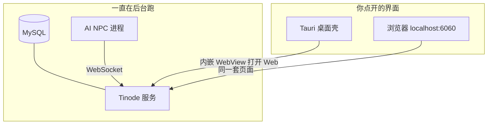
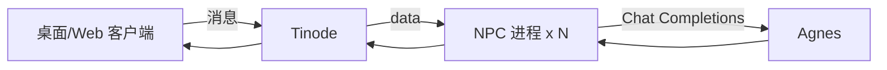

# VibeChat

基于 [Tinode](https://github.com/tinode/chat) 的自托管即时通讯。

## 架构（先看这个）

**不是**「整个项目编译成一个桌面 exe」。IM 永远是两层：

| 层 | 是什么 | 在哪 | 干什么 |
|----|--------|------|--------|
| **服务端** | Tinode + MySQL + AI NPC | Docker / 后台进程 | 存账号、消息、在线状态、NPC 大脑 |
| **客户端** | 桌面 GUI / 网页 | 你操作的窗口 | 登录、聊天、建群 |

类比：微信电脑版 = 客户端；微信服务器 = 腾讯机房。  
你不可能把「微信服务器」编译进桌面图标里——同样，VibeChat 的 Docker 服务端也不会塞进客户端窗口。



**主客户端：**
- **Windows 日常**：桌面 `VibeChat.lnk` → Edge 应用窗打开 `localhost:6060`
- **WSL 试验**：`desktop-tauri/`（WebKit，界面引擎不同，观感会略变）

### 重要：打包网页不会「改界面」

正确包装只是换「用什么容器打开同一 URL」：

| 打开方式 | 页面 HTML/CSS/JS | 观感为何可能不同 |
|----------|------------------|------------------|
| 浏览器 | `localhost:6060` 原版 | 基准 |
| Edge `--app` | **同一套** | 几乎相同（同 Chromium） |
| WSL Tauri | **同一套** | 不同：WebKit 渲染 + Linux 窗口边框 + WSLg |

若你看到的是 **完全另一套登录/列表 UI**，那不是网页包装，而是误开了 **Qt 客户端**（`client/` / `VibeChat-Desktop`）。

## 桌面客户端

### Windows 桌面（推荐：界面与网页一致）

```bash
powershell.exe -ExecutionPolicy Bypass -File /home/hkm/projects/teleg/desktop-tauri/install-windows-shortcut.ps1
```

双击 **VibeChat** = Edge 无地址栏窗口，页面就是 `http://localhost:6060/`。  
先保证服务端：`sudo docker compose up -d`。

### WSL 内 Tauri（可选，会有 Linux/WebKit 味）

```bash
cd /home/hkm/projects/teleg/desktop-tauri
./start.sh
```

## 一键启动（服务端 + NPC；WSL 内另开 Tauri）

```bash
cd /home/hkm/projects/teleg
./start-desktop.sh
```

Windows 日常请用桌面 Edge 快捷方式，不要用 WSL Tauri 当主入口。

## 分步启动 / 停止

```bash
cd /home/hkm/projects/teleg
sudo service docker start   # WSL 重启后如需要
sudo docker compose up -d
sudo docker compose ps
```

- 网页 / Edge 壳：**http://localhost:6060/**（界面一致）
- WSL Tauri：`cd desktop-tauri && ./start.sh`（同页，引擎不同）
- 备选 Qt：`cd client && ./start.sh`（**另一套 UI**，不是网页）
- NPC：`cd npc && ./start.sh`

## 演示账号

| 账号 | 密码 | 人设 |
|------|------|------|
| alice | alice123 | 三月七 |
| bob | bob123 | 流萤 |
| carol | carol123 | 花火 |
| hsr_* | npc123456 | 其余星穹铁道角色（NPC 首次启动自动注册） |
| 自行注册 | — | 你的真人账号（推荐） |

开发环境邮件验证码固定 **`123456`**。

> 不要用 NPC 账号登录客户端；用**新注册账号**和他们聊。

## AI NPC（星穹铁道全角色）

约 **80** 名可玩角色在线（`npc/personas.json`，源：`vibechat_npc/roster.py`）。

```bash
cd /home/hkm/projects/teleg/npc
./start.sh
# 日志可重定向: ./start.sh 2>&1 | tee /tmp/vibechat-npc.log
```

- 私聊：直接回复
- 群聊：被 **@角色名** 或消息里点名才回复（防 80 人刷屏）
- 新角色账号：`hsr_<id>` / `npc123456`，登录时自动注册
- 改花名册：`python3 gen_personas.py` 后重启 NPC



### 怎么测

1. 启动 Tinode + NPC  
2. 打开桌面客户端或网页，**注册**真人号  
3. 搜索 `alice` / `卡芙卡` / `hsr_kafka` 开聊  

## 桌面客户端（原生 PySide6，不是网页）

Qt 原生窗口，WebSocket 直连 Tinode，**不依赖浏览器**。

```bash
cd /home/hkm/projects/teleg/client
chmod +x start.sh
./start.sh
```

功能：登录、私聊、搜索角色、建群（搜索多选成员）、群内加成员。  
需图形环境（WSLg / Windows 远程显示）。若无窗口，检查 `DISPLAY` / WSLg。

## 群组随机发言

群聊里 NPC **随机插话**（不需要 @），受全局 Agnes 限流：

| 变量 | 默认 | 说明 |
|------|------|------|
| `NPC_AGNES_RPM` | `20` | 全局限流（次/分钟） |
| `NPC_GROUP_REPLY_CHANCE` | `0.12` | 每个 NPC 对真人消息的插话概率 |
| `NPC_GROUP_MAX_REPLIES` | `2` | 同一条群消息最多几个 NPC 接话 |

`@角色名` 仍会优先接话。NPC 之间不会互相随机刷屏。

## 群组「加成员」说明

### 原版 Web（localhost:6060）

Tinode 原版流程（容易误以为没入口）：

1. 先用 **Find / 搜索** 加过联系人（或聊过天）  
2. 左上角 **+ → new group** 建群  
3. 建群页的成员列表 **只显示已有联系人**；没有联系人时像「没法加成员」  
4. 建好后点会话标题 → **Info → Members → Add members**（同样只列联系人）

### 桌面客户端

**新建群组** 可直接搜角色名/用户名并多选，不依赖联系人列表。

## 可选环境变量

| 变量 | 默认 | 说明 |
|------|------|------|
| `AGNES_API_KEY` | 读 Windows | API Key |
| `AGNES_MODEL` | `agnes-2.5-flash` | 主模型 |
| `AGNES_FALLBACK_MODEL` | `agnes-2.0-flash` | 回退 |
| `TINODE_WS` | `ws://127.0.0.1:6060/v0/channels` | Tinode WS |
| `NPC_PERSONAS` | `npc/personas.json` | 人设文件 |
| `NPC_CONNECT_CONCURRENCY` | `12` | 同时握手路数 |

## 品牌

```bash
sudo docker cp tinode-srv:/opt/tinode/static ./branding/static
python3 branding/apply-brand.py
sudo docker compose restart tinode
```

## 数据重置

```bash
sudo docker compose down -v
sudo docker compose up -d
```