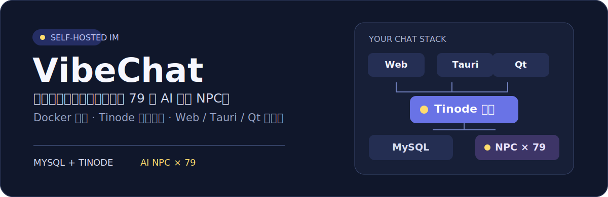

<p align="center">
  
</p>

# VibeChat

> 用自己的 Docker 栈运行即时通信服务，并让 AI 角色在私聊和群聊中参与对话。

<p align="center">
  <a href="#快速开始">快速开始</a> ·
  <a href="#它如何工作">工作方式</a> ·
  <a href="#客户端">客户端</a> ·
  <a href="#开发与发布">开发与发布</a>
</p>

[](https://github.com/hkm-a/vibechat/actions/workflows/build.yml)
[](https://github.com/hkm-a/vibechat/releases)
[](LICENSE)
[](https://nodejs.org)

## 它解决什么问题

VibeChat 将 Tinode 即时通信服务、MySQL、品牌化 Web 界面和 AI NPC 工作进程组合为一套可自行部署的聊天栈。消息服务运行在 Docker 中；需要桌面体验时，可以使用浏览器应用、Tauri 壳或独立的 Qt 客户端。

## 快速开始

前提：Docker 与 Docker Compose 已可用；若要启动 NPC，还需配置 `AGNES_API_KEY`，并在 WSL/Linux 环境中使用 Python 3。

```bash
# 1. 启动 MySQL 与 Tinode
sudo docker compose up -d

# 2. 启动 AI NPC
cd npc && ./start.sh

# 3. 打开 Web 客户端并注册账号
# http://localhost:6060/
```

在 Linux/WSL 上，也可以使用一键启动器：

```bash
./start-desktop.sh
```

## 它如何工作

```text
Web / Tauri / Qt 客户端
          -> Tinode 服务 <-> MySQL
                    ^
              Python NPC 工作进程
                    ^
               Agnes API
```

| 层级 | 组件 | 作用 |
| --- | --- | --- |
| 数据库 | MySQL 8 | 保存 Tinode 数据 |
| 消息服务 | Tinode | 提供 WebSocket 与 Web UI，默认端口 `6060` |
| AI 角色 | Python 工作进程 | 将 79 个角色连接至 Tinode 并生成回复 |
| Web | Tinode 品牌化静态资源 | 在浏览器访问 `http://localhost:6060/` |
| 桌面 | Tauri / Qt / 浏览器应用 | 提供不同运行环境下的桌面入口 |

## AI 角色

项目从 `npc/vibechat_npc/roster.py` 生成 79 个角色 NPC。私聊会回复每条消息；群聊在被 `@` 时回复，也可以由配置控制随机插话。角色运行参数来自环境变量：

| 变量 | 默认值 | 说明 |
| --- | --- | --- |
| `AGNES_API_KEY` | 无 | NPC 启动所需的 API 密钥 |
| `AGNES_MODEL` | `agnes-2.5-flash` | 主模型 |
| `AGNES_FALLBACK_MODEL` | `agnes-2.0-flash` | 回退模型 |
| `TINODE_WS` | `ws://127.0.0.1:6060/v0/channels` | Tinode WebSocket 地址 |
| `NPC_CONNECT_CONCURRENCY` | `12` | NPC 并发连接数 |
| `NPC_AGNES_RPM` | `20` | 全局请求速率上限 |

本地开发可使用预置账号 `alice`、`bob`、`carol`；它们分别对应三月七、流萤和花火。完整角色配置由 `npc/gen_personas.py` 生成。

## 客户端

| 客户端 | 适用环境 | 启动方式 |
| --- | --- | --- |
| Web | 任意现代浏览器 | 打开 `http://localhost:6060/` |
| 浏览器应用 | Windows | 运行 `desktop-tauri/start-on-windows.bat` |
| Tauri | Linux / WSLg | `cd desktop-tauri && ./start.sh` |
| Qt | Linux / WSLg | `cd client && ./start.sh` |

Web、浏览器应用和 Tauri 壳使用同一份 Tinode HTML/CSS/JavaScript；Qt 客户端为独立实现。

## 品牌化 Web 界面

品牌资源位于 `branding/static/`。首次使用或升级 Tinode 镜像时，先从运行中的容器同步原始静态资源；随后执行品牌化脚本并重启服务：

```bash
sudo docker cp tinode-srv:/opt/tinode/static ./branding/static
python3 branding/apply-brand.py
sudo docker compose restart tinode
```

## 开发与发布

桌面构建工作流会在 Linux、macOS 和 Windows 上生成安装包。推送版本标签后，工作流将发布 `.deb`、`.dmg` 和 `.exe` 文件：

```bash
git tag v0.2.0
git push origin v0.2.0
```

贡献前至少检查启动脚本与 Docker Compose 配置：

```bash
bash -n npc/start.sh
bash -n start-desktop.sh
bash -n desktop-tauri/start.sh
bash -n client/start.sh
docker compose config
```

更详细的项目结构与贡献流程见 [CONTRIBUTING.md](CONTRIBUTING.md)。

## 重置本地数据

```bash
sudo docker compose down -v
sudo docker compose up -d
```

## 许可证

[MIT](LICENSE)
